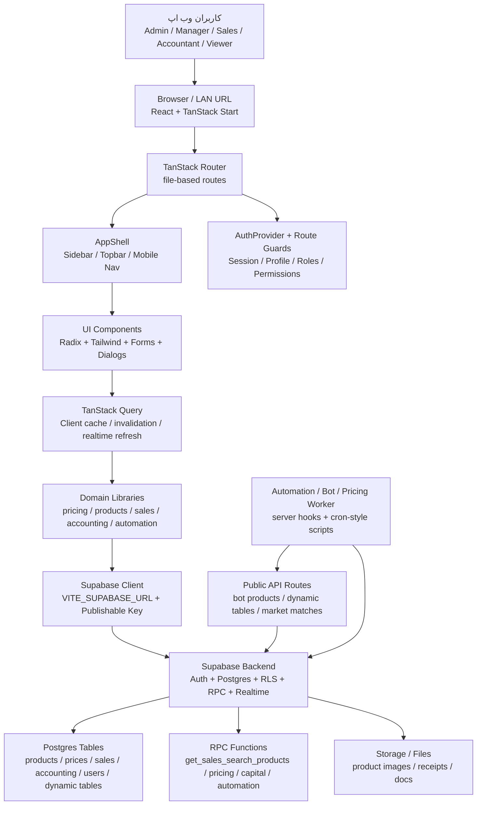
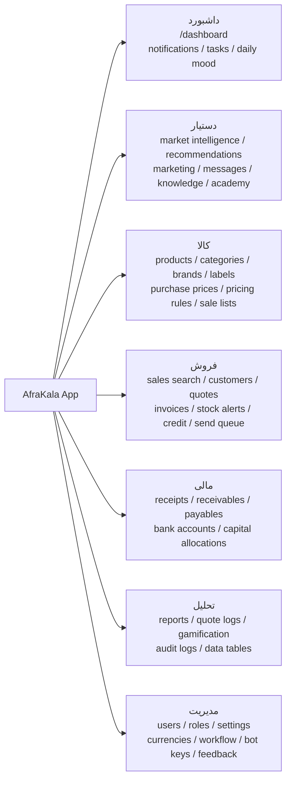
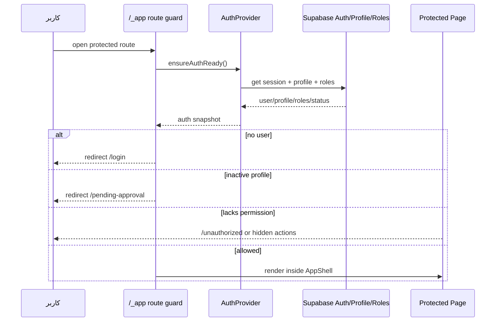
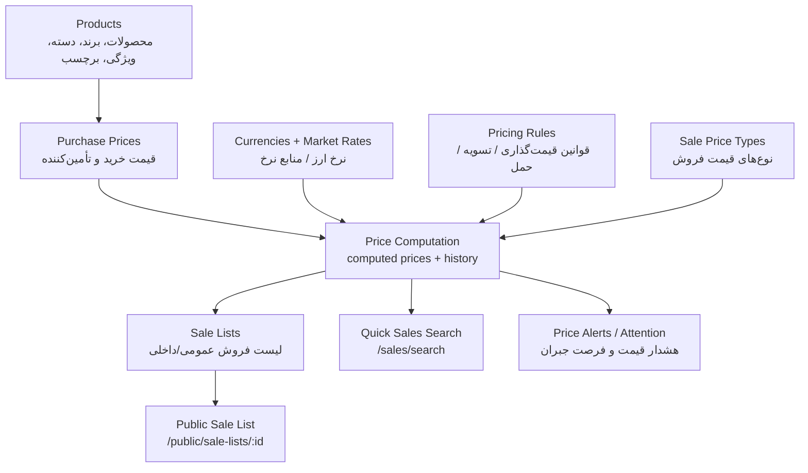
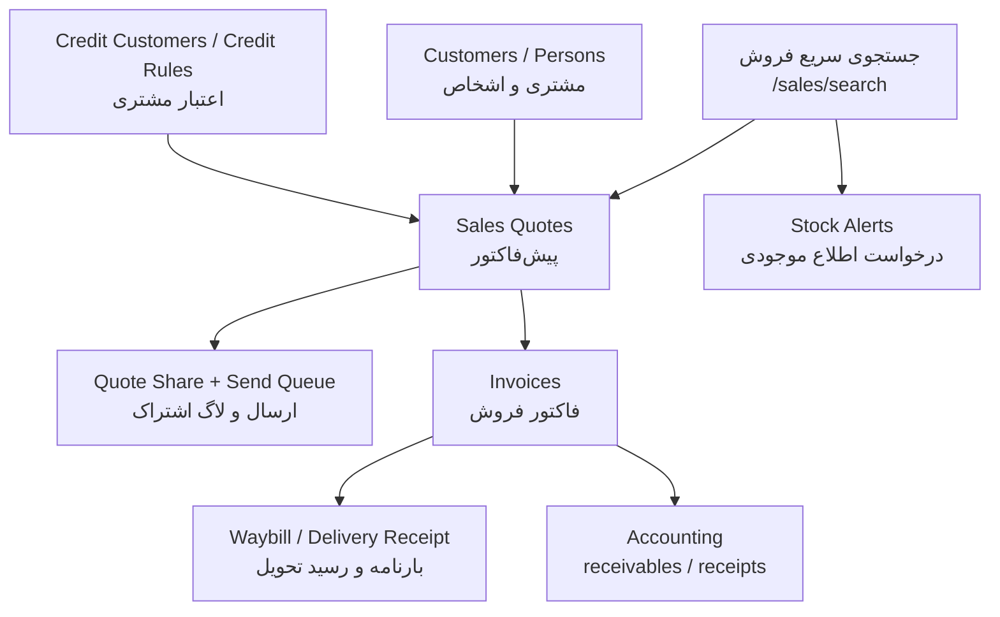
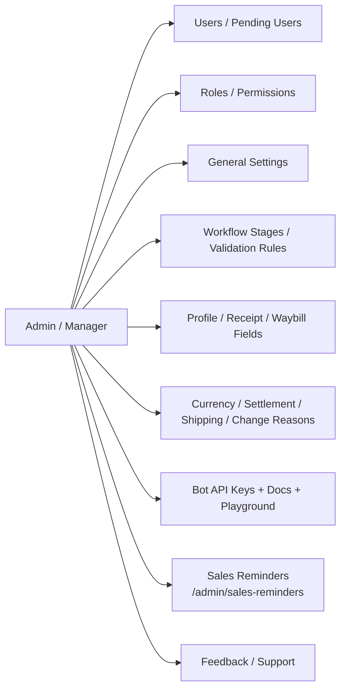
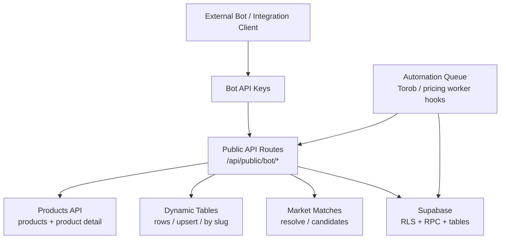
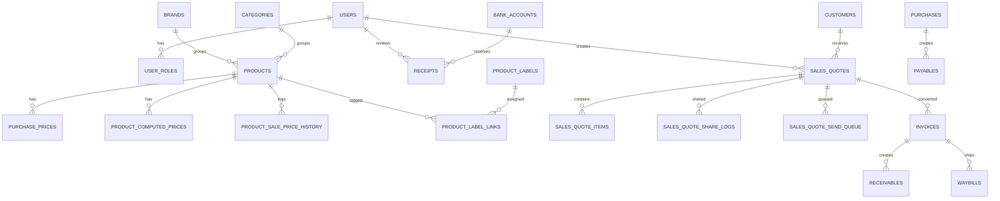

# AfraKala Web App Schematic

این شماتیک بر اساس ساختار فعلی کد در `app/src/routes`، `app/src/lib`، `primary-modules.ts` و اتصال Supabase تهیه شده است.

## 1. High-Level Architecture

## 2. Primary Module Map

## 3. Authentication And Authorization Flow

## 4. Product And Pricing Flow

## 5. Sales Workflow

## 6. Admin And Configuration Surface

## 7. External And Automation Interfaces

## 8. Main Data Domains

## 9. Important Notes From Current Code

- Frontend framework: React 19 + TanStack Start/Router + TanStack Query.
- UI stack: Tailwind CSS, Radix UI, lucide-react, sonner.
- Backend: Supabase Auth, Postgres, RLS policies, RPC functions, realtime subscriptions.
- Protected app routes live under `/_app`.
- Public entry points include `/login`, `/register`, `/public/sale-lists/:listId`, `/api/public/bot/*`.
- Seven primary navigation modules are defined in `src/components/layout/primary-modules.ts`.
- Route-level permissions use `requirePermission` / `requireAnyRole`.
- The pricing/sales pages heavily depend on RPC functions such as `get_sales_search_products`.
- Bot and automation integrations are exposed through API routes and Supabase-backed keys/queues.

