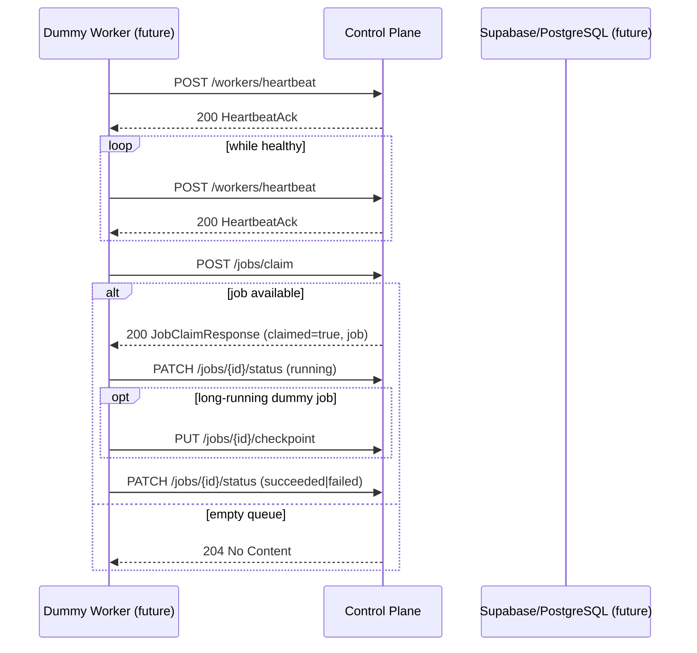

# Dummy Worker Contract (Phase-0)

**Status:** Contract-only — **not a real bot**  
**Baseline tag:** `baseline/v2026.06.05`  
**OpenAPI version:** `1.0.0-phase0`  
**Audience:** Platform maintainers, future Python worker implementers, reviewers

## Summary

This document defines the **Dummy Worker** — a contractual stand-in for an external Python Worker Runtime. Phase-0 does **not** ship executable worker code, Docker images, browser automation, or marketplace integrations.

The dummy worker exists so the team can review **behavior, security boundaries, and API semantics** before any implementation lands in the control plane or a separate worker repository.

## Non-goals (Phase-0)

The dummy worker contract explicitly excludes:

- Divar, Torob, WhatsApp, Instagram integrations
- OCR, STT, or AI pipelines
- Real browser or messaging clients
- Production database writes (no migrations in Phase-0)
- Parallel cores (Laravel, FastAPI control-plane)
- Changes to `/api/public/bot/*`, pricing, accounting, invoices, customers, persons, or credit

## Architecture roles

| Component | Location | Phase-0 |
|-----------|----------|---------|
| Control Plane / Core | `afrakala-platform` (get-git-going) | Contracts only |
| Source of truth | Supabase / PostgreSQL | Future job persistence |
| Operator UI | React / TanStack / Lovable | UI only — no worker logic |
| Worker runtime | **Separate** deploy unit (Python, future) | Documented behavior only |
| Contracts | `openapi/automation-v1.yaml`, `automation/schemas/` | Authoritative |

## Identity and authentication

| Rule | Requirement |
|------|-------------|
| Worker ID | Stable UUID per worker instance (`worker_id`) |
| Auth | `Authorization: Bearer <server-issued-token>` |
| Secret storage | Server env only — **never** `VITE_` prefix or frontend bundles |
| Registration | Implicit on first valid heartbeat (future implementation detail) |

## Lifecycle (contractual)



### Step 1 — Heartbeat

Workers report liveness and capacity on a fixed interval. See [WORKER_HEARTBEAT_CONTRACT.md](./WORKER_HEARTBEAT_CONTRACT.md).

- Endpoint: `POST /api/automation/v1/workers/heartbeat`
- Payload: validates against `automation/schemas/heartbeat.schema.json`

### Step 2 — Claim job

Workers poll for work matching their capability tags. See [JOB_CLAIM_CONTRACT.md](./JOB_CLAIM_CONTRACT.md).

- Endpoint: `POST /api/automation/v1/jobs/claim`
- Empty queue: HTTP `204` (no body)

### Step 3 — Execute (dummy actions only)

Phase-0 job types and actions are **generic only**:

| Job `type` | `payload.action` | Dummy behavior (future) |
|------------|------------------|-------------------------|
| `generic.echo` | `echo` | Return `input` in `result.output` |
| `generic.noop` | `noop` | Succeed immediately with empty output |
| `generic.healthcheck` | `healthcheck` | Return `{ "ok": true }` in `result.output` |

No network calls, no filesystem side effects beyond local logging, no external APIs.

### Step 4 — Checkpoint (optional)

Long-running dummy jobs may report progress. See [CHECKPOINT_CONTRACT.md](./CHECKPOINT_CONTRACT.md).

- Endpoint: `PUT /api/automation/v1/jobs/{jobId}/checkpoint`

### Step 5 — Complete

Workers report terminal status via:

- Endpoint: `PATCH /api/automation/v1/jobs/{jobId}/status`
- Terminal statuses: `succeeded`, `failed`, `cancelled`

Authoritative job state must flow through the control plane / Supabase — not worker-local databases for shared state.

## Capability tags

Phase-0 capability strings must match:

```
^[a-z][a-z0-9._-]{1,63}$
```

Allowed examples (documented generic tags only):

- `generic.echo`
- `generic.noop`
- `generic.healthcheck`

Marketplace-specific tags (e.g. `divar.scrape`, `whatsapp.send`) are **forbidden** in Phase-0.

## Concurrency

| Field | Default | Max (Phase-0 contract) |
|-------|---------|------------------------|
| `max_concurrent_jobs` (heartbeat) | 1 | 100 |
| `max_jobs` (claim request) | 1 | 10 |
| `active_jobs` (heartbeat) | 0 | 100 |

A worker must not claim more jobs than its reported capacity.

## Error handling (contractual)

| Situation | Worker action | HTTP expectation |
|-----------|---------------|----------------|
| Invalid payload | Do not retry blindly; fix payload | 400 |
| Unauthorized | Stop and alert operator | 401 |
| Control plane unavailable | Exponential backoff; continue heartbeats | 503 |
| Job not found on status update | Log and stop job locally | 404 |
| Claim returns 204 | Wait `poll_interval_seconds` (default 5s) and retry |

## Observability (future)

Workers should log (locally, not in shared DB):

- `worker_id`, job `id`, `type`, status transitions
- Checkpoint sequence numbers
- **No secrets**, PII, or marketplace credentials in logs

## Phase-0 validation (no runtime)

Until APIs are implemented, reviewers validate:

1. Sample JSON against `automation/schemas/*.json` (e.g. `ajv` CLI)
2. OpenAPI renders without marketplace-specific paths
3. All five `docs/automation/*` contracts are internally consistent
4. [E2E_SMOKE_PLAN_PHASE0.md](./E2E_SMOKE_PLAN_PHASE0.md) checklist passes

## Example: full dummy job flow (JSON only)

**Heartbeat:**

```json
{
  "worker_id": "550e8400-e29b-41d4-a716-446655440000",
  "reported_at": "2026-06-05T12:00:00Z",
  "status": "healthy",
  "capabilities": ["generic.echo"],
  "active_jobs": 0,
  "max_concurrent_jobs": 1,
  "version": "phase0-contract-review"
}
```

**Claim request:**

```json
{
  "worker_id": "550e8400-e29b-41d4-a716-446655440000",
  "capabilities": ["generic.echo"],
  "max_jobs": 1
}
```

**Claim response:**

```json
{
  "claimed": true,
  "job": {
    "id": "6ba7b810-9dad-11d1-80b4-00c04fd430c8",
    "type": "generic.echo",
    "status": "claimed",
    "created_at": "2026-06-05T12:00:01Z",
    "payload": {
      "action": "echo",
      "input": { "message": "phase0-contract-check" }
    }
  }
}
```

**Status update (succeeded):**

```json
{
  "status": "succeeded",
  "progress_percent": 100,
  "message": "echo completed"
}
```

## Review checklist (team sign-off)

- [ ] Confirms Phase-0 is contract-only — no real bot
- [ ] No marketplace or AI integrations referenced as in-scope
- [ ] Auth model rejects frontend secrets
- [ ] Job types limited to generic echo/noop/healthcheck
- [ ] Checkpoint and claim contracts read and accepted
- [ ] Boundary fence ([PHASE0_BOUNDARY_FENCE.md](./PHASE0_BOUNDARY_FENCE.md)) acknowledged

## Related

- [WORKER_HEARTBEAT_CONTRACT.md](./WORKER_HEARTBEAT_CONTRACT.md)
- [JOB_CLAIM_CONTRACT.md](./JOB_CLAIM_CONTRACT.md)
- [CHECKPOINT_CONTRACT.md](./CHECKPOINT_CONTRACT.md)
- [E2E_SMOKE_PLAN_PHASE0.md](./E2E_SMOKE_PLAN_PHASE0.md)
- [PHASE0_BOUNDARY_FENCE.md](./PHASE0_BOUNDARY_FENCE.md)
- [openapi/automation-v1.yaml](../../openapi/automation-v1.yaml)
- Baseline `automation/worker-dummy/README.md` (placeholder pointer)
