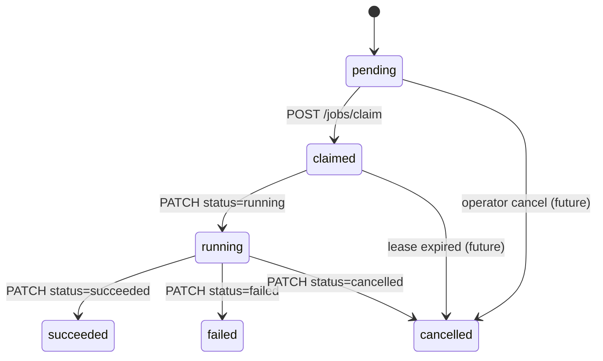

# Job Claim Contract (Phase-0)

**Status:** Contract-only — no queue implementation in Phase-0  
**Baseline tag:** `baseline/v2026.06.05`  
**Job schema:** `automation/schemas/job.schema.json`  
**HTTP:** `POST /api/automation/v1/jobs/claim`

## Purpose

Job claim defines how an external worker requests the next available job from the control plane. Phase-0 specifies semantics for a **generic dummy queue** — no Supabase tables, no `FOR UPDATE SKIP LOCKED` implementation, and no marketplace job types.

This contract is informed by the existing in-repo **pricing recompute worker** pattern (server hook + PostgreSQL claim function) but applies to the **separate** `/api/automation/v1` namespace only.

## Request

| Property | Value |
|----------|-------|
| Method | `POST` |
| Path | `/api/automation/v1/jobs/claim` |
| Auth | `WorkerBearerAuth` |
| Content-Type | `application/json` |

### Body — JobClaimRequest

| Field | Required | Type | Default | Constraints |
|-------|----------|------|---------|-------------|
| `worker_id` | yes | `uuid` | — | Must match heartbeat `worker_id` |
| `capabilities` | yes | `string[]` | — | Subset of worker's advertised capabilities |
| `max_jobs` | no | `integer` | `1` | 1–10 |

### Capability matching (future)

The control plane returns a job where:

```
job.type ∈ capabilities OR job.type maps to a capability tag
```

Phase-0 mapping is 1:1:

| `job.type` | Required capability |
|------------|---------------------|
| `generic.echo` | `generic.echo` |
| `generic.noop` | `generic.noop` |
| `generic.healthcheck` | `generic.healthcheck` |

## Response

### 200 OK — job claimed or explicit empty

```json
{
  "claimed": true,
  "job": { "...": "AutomationJob per job.schema.json" }
}
```

When `claimed` is `false`, `job` may be omitted:

```json
{
  "claimed": false
}
```

**Note:** Prefer HTTP `204` for empty queue (see below). Implementations may use either `204` or `200` with `claimed: false` — workers must handle both in a later phase. Phase-0 contract lists **`204` as canonical** for empty queue.

### 204 No Content — empty queue

No response body. Worker should wait before polling again.

| Parameter | Contract default |
|-----------|------------------|
| `poll_interval_seconds` | 5 |
| `poll_interval_jitter` | ±20% (recommended) |

### Error responses

| Code | Meaning |
|------|---------|
| `401` | Invalid or missing bearer token |
| `400` | Invalid claim payload (future) |

## Job envelope (claimed job)

Claimed jobs validate against `automation/schemas/job.schema.json`.

### Required fields

| Field | Description |
|-------|-------------|
| `id` | Job UUID |
| `type` | Generic type (`generic.echo`, etc.) |
| `status` | On claim: transitions to `claimed` |
| `created_at` | ISO-8601 |
| `payload` | Action envelope (Phase-0: `echo`, `noop`, `healthcheck` only) |

### Claim metadata (set by control plane on claim)

| Field | Description |
|-------|-------------|
| `claimed_by` | `worker_id` |
| `claimed_at` | ISO-8601 timestamp |
| `timeout_seconds` | Default 300; max 86400 |

## Status transitions



| From | To | Actor | HTTP |
|------|-----|-------|------|
| `pending` | `claimed` | Control plane | (internal on claim) |
| `claimed` | `running` | Worker | `PATCH /jobs/{id}/status` |
| `running` | `succeeded` | Worker | `PATCH /jobs/{id}/status` |
| `running` | `failed` | Worker | `PATCH /jobs/{id}/status` |
| `*` | `cancelled` | Worker or operator | `PATCH /jobs/{id}/status` |

Invalid transitions return `400` (future implementation).

## Lease and timeout (contractual)

| Rule | Value |
|------|-------|
| Default `timeout_seconds` | 300 |
| Worker must start (`running`) within | 60s of claim (recommended) |
| Lease renewal | Via heartbeat `active_jobs` + status `running` (future) |
| Expired claim | Job returns to `pending` (future — requires DB) |

Phase-0 documents lease behavior; persistence is a **later phase**.

## Concurrency rules

1. Worker must not claim if `active_jobs >= max_concurrent_jobs` (from last heartbeat).
2. `max_jobs` in claim request must not exceed remaining capacity.
3. One claim call returns at most **one** job in Phase-0 (batch claim is out of scope).

## Idempotency (future)

Duplicate claim from the same worker for the same job must not double-execute. Implementation should use:

- `claimed_by` + `job.id` uniqueness constraint (future migration)
- Worker-side tracking of in-flight job IDs

Phase-0: document only.

## Priority (informational)

`job.priority` range 0–100 (default 50). Higher priority jobs dispatch first (future). Phase-0 does not require priority scheduling in smoke tests.

## Example flow

**Request:**

```json
{
  "worker_id": "550e8400-e29b-41d4-a716-446655440000",
  "capabilities": ["generic.echo"],
  "max_jobs": 1
}
```

**Response (claimed):**

```json
{
  "claimed": true,
  "job": {
    "id": "6ba7b810-9dad-11d1-80b4-00c04fd430c8",
    "type": "generic.echo",
    "status": "claimed",
    "priority": 50,
    "created_at": "2026-06-05T12:00:01Z",
    "claimed_by": "550e8400-e29b-41d4-a716-446655440000",
    "claimed_at": "2026-06-05T12:00:02Z",
    "timeout_seconds": 300,
    "payload": {
      "action": "echo",
      "input": { "message": "phase0-contract-check" },
      "correlation_id": "smoke-001"
    }
  }
}
```

**Start execution:**

```json
PATCH /api/automation/v1/jobs/6ba7b810-9dad-11d1-80b4-00c04fd430c8/status
{ "status": "running", "progress_percent": 0 }
```

## Phase-0 validation

Reviewers confirm:

- [ ] Claim request schema matches OpenAPI `JobClaimRequest`
- [ ] Sample claimed job validates against `job.schema.json`
- [ ] No marketplace `type` values in fixtures
- [ ] Empty queue behavior documented as `204`

## Related

- [DUMMY_WORKER_CONTRACT.md](./DUMMY_WORKER_CONTRACT.md)
- [WORKER_HEARTBEAT_CONTRACT.md](./WORKER_HEARTBEAT_CONTRACT.md)
- [CHECKPOINT_CONTRACT.md](./CHECKPOINT_CONTRACT.md)
- [openapi/automation-v1.yaml](../../openapi/automation-v1.yaml)
