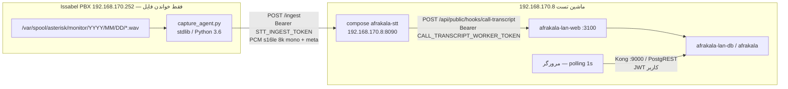

# طراحی فاز A — رونویسی تماس فارسی

شاخه: `feature/call-transcription` @ G1 applied
ماشین سرویس: `192.168.170.8` (تست). تولید و PBX دست‌نخورده می‌مانند.

پاسخ مالک در ۱۴۰۵-۰۷-۰۴ اعمال شد. ساخت بدون توقف دیگر تا پایان فاز A ادامه می‌یابد.

---

## 1. نمودار اجزا



| مرز | پروتکل | احراز | پورت / مسیر |
|---|---|---|---|
| capture → STT | HTTP JSON + بدنهٔ PCM خام (یا chunk base64 در JSON کوچک) | `Authorization: Bearer ${STT_INGEST_TOKEN}` | `http://192.168.170.8:8090/ingest` و `/ingest/eof` |
| STT سلامت | HTTP | بدون توکن | `GET /health` ، `GET /metrics` |
| STT → AfraKala | HTTP JSON | `Authorization: Bearer ${CALL_TRANSCRIPT_WORKER_TOKEN}` | از داخل کانتینر STT: `http://192.168.170.8:3100/api/public/hooks/call-transcript` (نه `127.0.0.1` — آن خودِ کانتینر است). لیست هدف در config؛ تولید بعدی: `http://192.168.170.10:3000` |
| مرورگر → متن | PostgREST از طریق Kong | JWT نقش کاربر + RLS | همان استک فعلی؛ Realtime نیست |
| پیام‌رسان (اختیاری G6) | OpenAI-compatible | `WHISPER_API_KEY` اگر ست شود | `POST http://192.168.170.8:8090/v1/audio/transcriptions` |

**نگهداری صدا**

- قطعهٔ خام PCM روی STT پس از رونویسی نهایی همان تماس حذف می‌شود.
- پوشهٔ `D:\afrakala-stt\data` فقط scratch است (اسپول، افست، فایل نیمه‌کاره).
- تنها جایی که صدا نگه داشته می‌شود `D:\afrakala-stt\eval` است و فقط فایل‌هایی که مالک خودش آنجا بگذارد.
- مدل‌ها فقط در `D:\afrakala-stt\models`.
- هیچ صدایی به گیت یا به جدول Postgres نمی‌رود.

**جایگزینی منبع در فاز B**

قرارداد ingest ثابت می‌ماند: `recording_filename` + `recording_uniqueid` + PCM 8 kHz mono + `eof`. فاز B فقط تولیدکننده را عوض می‌کند (ARI `snoop` / `externalMedia`). capture agent و جداول و hook دست نمی‌خورند.

**محدودیت منابع STT (تا Ollama گرسنه نماند)**

بازبینی C6 در ۱۴۰۵-۰۷-۰۴: `curl.exe -s http://localhost:11434/api/ps` → `{"models":[]}` (هیچ مدلی load نیست). `GET /api/tags` مدل‌های `qwen2.5:14b`، `qwen2.5:7b`، `bge-m3`، `qwen3.6` را نشان داد. Ollama روی هاست گوش می‌دهد، نه به‌صورت کانتینر Docker. حدهای CPU/RAM همان طرح اولیه می‌ماند:

- سرویس inference: `cpus: 6.0` ، `mem_limit: 16g` ، reservation `cpus: 2` / `memory: 4g`
- بقیهٔ هسته‌ها و RAM برای وب، DB، و Ollama می‌ماند

**فایروال ویندوز (C4 — اقدام مالک، عامل اجرا نمی‌کند)**

PBX باید به `192.168.170.8:8090` برسد. قاعدهٔ inbound فقط از `192.168.170.252` و خود ماشین تست. دستور دقیق در `RUNBOOK-pbx-install.md` می‌آید. عامل این دستور را اجرا نمی‌کند.

کد سرویس در ریپو: `deploy/stt/` (compose جدا با نام پروژه `afrakala-stt`). پوشهٔ `services/` در این ریپو رسم نیست؛ workerهای LAN امروز زیر `deploy/` زندگی می‌کنند.

---

## 2. اتصال تماس به فایل ضبط

### شکل نام فایل (Issabel)

`${ARG1}-${ARG2}-${FROMEXTEN}-${TIMESTR}-${UNIQUEID}.wav`

`TIMESTR` دو قطعه است: `YYYYMMDD-HHMMSS`. توکن آخر (ممکن است نقطه داشته باشد) `UNIQUEID` کانال ضبط است، نه لزوماً `linkedid`.

نمونه‌های مورد انتظار:

- ورودی داخلی: `exten-403-09...-20260926-143022-1727351422.123.wav` → داخلی = توکن دوم
- خروجی: `out-09...-403-20260926-143022-1727351422.123.wav` → داخلی = `FROMEXTEN` (توکن سوم)
- صف: `q-6001-09...-20260926-143022-1727351422.123.wav` → داخلی در نام نیست؛ صف = توکن دوم

`.gsm` و پیشوند ناشناخته / `internal` نادیده (قابل تنظیم).

### الف) زنده — همزمان با popup / `call_ring_events`

popup هر ۱۰۰۰ ms از `call_ring_events` می‌خواند و `linkedid` / `uniqueid` را در `metadata` کارت می‌گذارد (`recent-calls.ts`).

ترتیب تطبیق روی هر قطعهٔ اول و هر EOF:

1. `call_ring_events.uniqueid = recording_uniqueid`
2. `call_ring_events.linkedid = recording_uniqueid`
3. اگر داخلی از نام فایل استخراج شد: همان `extension` + `event_at` در بازهٔ **±۳۰ ثانیه** از `TIMESTR` (تهران تفسیر می‌شود، ذخیره UTC) — **فقط اگر دقیقاً یک کاندیدا بماند**؛ وگرنه unlink (فقط admin/manager)
4. اگر صف است: هر ring با `linkedid` برابر یکی از (۲)؛ `employee_id` فقط وقتی ست می‌شود که دقیقاً یک کاندیدای mapped بماند

نتیجه روی `call_transcript_sessions`: `ring_event_id`، `linkedid`، `extension`، `employee_id` (از ring یا از `call_log_extensions`).

UI زنده کارت جاری را با `metadata.uniqueid` / `metadata.linkedid` / `extension` به session وصل می‌کند. تا وقتی `employee_id` خالی است، RLS فقط admin/manager می‌بیند — فروشنده متن همکار را از این راه نمی‌بیند.

### ب) نهایی — بعد از واردسازی CDR (حدود ۲ تا ۴ دقیقه)

امروز `external_id = linkedid` است و `recordingfile` خوانده نمی‌شود. تغییر importer (بدون وصل به PBX واقعی؛ تست با fixture):

- SELECT پاها اضافه می‌کند: `recordingfile` (به `uniqueid` و `linkedid` موجود).
- `GroupedCall` دو فیلد تازه می‌گیرد: `recordingFiles: string[]` (basename نرمال‌شده) و `legUniqueids: string[]`.
- `metadata` فعلی می‌ماند و دو کلید اضافه می‌شود:
  - `recording_files` — آرایهٔ basename
  - `leg_uniqueids` — آرایهٔ `uniqueid` پاها

کلیدهای قبلی (`raw_number`, `matched_via`, `queue`, `dcontexts`, `leg_count`, `unknown_number`, `stripped_number`) دست نمی‌خورند.

تابع `link_pending_transcript_sessions()` (SQL، فقط `service_role` / `supabase_admin`؛ `REVOKE EXECUTE FROM PUBLIC, anon, authenticated`) برای sessionهای بدون `call_log_id`:

1. basename فایل = هر عضو `call_logs.metadata.recording_files`
2. وگرنه `recording_uniqueid` = هر عضو `metadata.leg_uniqueids`
3. وگرنه `recording_uniqueid = call_logs.external_id` (وقتی کانال ضبط همان linkedid است)
4. وگرنه همان `extension` و `started_at` در **±۶۰ ثانیه** از `TIMESTR` — **فقط اگر دقیقاً یک ردیف بماند**؛ وگرنه unlink. `link_method='time_extension'`

fixture اجباری G2: دو تماس روی یک داخلی با فاصلهٔ ۴۰ ثانیه نباید به هم وصل شوند.

پس از تطبیق: `call_log_id`، `linkedid`، `employee_id` از `call_logs`، `status` به `final` یا `pending_final`.

**تلاش دوباره**

- بعد از هر insert موفق importer
- بعد از هر ingest اگر هنوز unlink است
- حلقهٔ کوتاه داخل STT هر ۳۰ s برای sessionهای بازِ کمتر از ۲۰ دقیقه
- هدف معیار A5: ۱۰۰٪ تماس خارجی ضبط‌شدهٔ شبیه‌سازی‌شده باید هم به ring زنده و هم به `call_logs` وصل شود

---

## 3. اسکیما

مهاجرت بعدی روی دیسک: سریال **592** (در لحظهٔ نوشتن از remote دوباره چک می‌شود). هیچ شیء موجودی drop/replace نمی‌شود.

### `call_transcript_sessions`

| ستون | نوع | نقش |
|---|---|---|
| `id` | uuid PK | |
| `recording_filename` | text UNIQUE NOT NULL | کلید فایل؛ basename |
| `recording_uniqueid` | text NOT NULL | توکن آخر نام |
| `uniqueid` | text NOT NULL | همان کانال ضبط |
| `linkedid` | text NULL | بعد از تطبیق |
| `call_log_id` | uuid NULL FK `call_logs(id)` ON DELETE SET NULL | |
| `ring_event_id` | uuid NULL FK `call_ring_events(id)` ON DELETE SET NULL | |
| `extension` | text NULL | |
| `employee_id` | uuid NULL | مالک دید |
| `direction` | text NULL | inbound/outbound |
| `prefix` | text NULL | exten/out/q |
| `queue` | text NULL | |
| `status` | text NOT NULL | `live` / `pending_final` / `final` / `unlinked` |
| `link_method` | text NULL | |
| `started_at` / `ended_at` | timestamptz NULL | |
| `created_at` / `updated_at` | timestamptz | |

ایندکس: `(employee_id, created_at DESC)`، `(linkedid)`، `(recording_uniqueid)`، `(call_log_id)`، `(status)` جایی که هنوز unlink است.

### `call_transcript_segments`

| ستون | نوع | نقش |
|---|---|---|
| `id` | uuid PK | |
| `session_id` | uuid FK CASCADE | |
| `kind` | text NOT NULL | `partial` / `committed` / `final` |
| `segment_seq` | int NOT NULL | |
| `text` | text NOT NULL | |
| `start_ms` / `end_ms` | int NULL | |
| `engine` | text NULL | |
| `latency_ms` | int NULL | از نوشتن chunk شبیه‌ساز تا ذخیره |
| `created_at` | timestamptz | |

UNIQUE `(session_id, segment_seq, kind)` — تحویل دوباره همان یک ردیف (idempotent). چک: `kind IN (...)`؛ برای JSONB اگر بعداً اضافه شد `COALESCE`.

INSERT/UPDATE/DELETE برای `authenticated` وجود ندارد. hook با `supabaseAdmin` می‌نویسد. GRANT SELECT به `authenticated`. `REVOKE ALL` هر دو جدول از `anon` و `PUBLIC`.

### RLS (سخت‌گیرانه‌تر یا برابر `call_logs`)

هر دو جدول:

```
employee_id = (SELECT auth.uid())
OR public.has_role((SELECT auth.uid()), 'admin'::text)
OR public.has_role((SELECT auth.uid()), 'manager'::text)
```

برای `segments` از طریق JOIN به session همان عبارت. `FORCE ROW LEVEL SECURITY`. بدون سیاست DELETE برای authenticated (حذف بی‌اثر + 204 تکرار نمی‌شود چون کلاینت حذف نمی‌کند).

وقتی `employee_id` هنوز NULL است، sales/accountant صفر ردیف می‌بینند؛ admin/manager همه را می‌بینند. حسابدار (مثلاً داخلی `402`) فقط ردیف `employee_id` خودش را می‌بیند — RLS او را به bypass ادمین اضافه نمی‌کند.

### `role_permissions`

ماژول `call-transcripts` برای **هر** `role_name` موجود:

- `can_view`: `admin`, `manager`, `sales`, **`accountant`**
- بقیهٔ فلگ‌ها false
- `viewer` ردیف صریح با `can_view=false` می‌گیرد تا `has_dynamic_permission` باز نشود

صفحهٔ جدا اگر ساخته شود از همین ماژول است. popup فعلی از allowlist مسیر sales-desk استفاده می‌کند؛ دیدن ردیف باز هم با RLS است نه با ماژول.

---

## 4. موتور

همه روی CPU (GPU نیست). انتخاب نهایی بعد از بنچمارک G3 با قاعدهٔ §5 مأموریت است، نه از روی حدس.

| نقش | نامزد | چرا |
|---|---|---|
| زنده / partial | Vosk `vosk-model-fa-0.42` | استریم واقعی؛ مناسب 8 kHz |
| نهایی | faster-whisper CPU `int8`، مدل فارسی مثل `oi-uae/farsi-faster-whisper-large-v3` و در صورت نیاز medium/small فارسی | دقت بالاتر؛ RTF معمولاً برای زنده روی این CPU کافی نیست |
| VAD | Silero (یا VAD خود faster-whisper برای مسیر نهایی) | سکوت و نویز نباید قطعهٔ متن بسازند (A4) |

**بنچمارک G3** (Ollama اگر روشن بود در بار ماشین ثبت می‌شود): RTF در ۱ / ۶ / ۸ استریم هم‌زمان؛ WER روی کلیپ با متن معلوم؛ p50/p95 تأخیر «chunk نوشته‌شده توسط شبیه‌ساز → ردیف در DB» روی ≥۴۰ گفته.

**قاعدهٔ انتخاب**

1. موتور زنده = دقیق‌ترین نامزدی که RTF ≤ 0.5 در ۸ استریم دارد (A1)
2. موتور نهایی = دقیق‌ترین نامزدی که A3 را دارد (متن نهایی ≤ ۵ دقیقه بعد از close، p95)
3. اگر هیچ Whisperای A1 را ندهد: Vosk زنده + بهترین Whisper نهایی
4. اگر هیچ‌کس A1 را ندهد: `PARTIAL` با عدد؛ آستانه شل نمی‌شود

انتظار مهندسی پیش از عدد: مسیر زنده = Vosk؛ مسیر نهایی = Whisper int8.

---

## 5. runtime عامل capture روی PBX

- یک فایل `capture_agent.py` با **فقط stdlib**، سازگار با Python 3.6 (`platform-python` راکی ۸).
- روی PBX بستهٔ جدید نصب نمی‌شود.
- فقط می‌خواند: tail فایل در حال رشد از offset 44، PCM `s16le` 8000 Hz mono؛ به اندازهٔ هدر WAV تا close اعتماد نمی‌کند.
- چند فایل هم‌زمان؛ چرخش روز تقویم تهران (`Asia/Tehran`) در نیمه‌شب.
- افست پایدار روی دیسک محلی (JSON) تا بعد از restart دوباره از اول نفرستد.
- اگر STT نباشد: اسپول کران‌دار محلی و retry؛ کرش و بلوک ممنوع.
- inactivity: فایلی که رشد نمی‌کند EOF منطقی می‌گیرد.
- هدف CPU: کمتر از ۲٪ یک هسته و RSS کمتر از ۵۰ MB با ۸ فایل — در کانتینر `rockylinux:8` اندازه گرفته می‌شود.
- مالک بعداً با `RUNBOOK-pbx-install.md` نصب می‌کند. این مأموریت به `192.168.170.252` وصل نمی‌شود.

شبیه‌ساز محلی WAV را مثل Asterisk می‌نویسد: هدر ۴۴ بایتی با size صفر، burst هر ۳۲ KiB با آهنگ واقعی، اصلاح هدر هنگام close.

---

## 6. جای UI زنده (قاعدهٔ G5)

`origin/feature/salesdesk-9-fixes` جد `origin/staging` است (G0، exit 0).

بنابراین:

- متن زنده داخل شیت `CallerInboundPopup` جاسازی می‌شود (نه صفحهٔ یتیم).
- polling جدا روی `call_transcript_sessions` / `segments` هر ۱۰۰۰ ms، فیلتر با `uniqueid`/`linkedid`/`extension` کارت.
- برچسب‌ها: «متن تماس»، «در حال رونویسی…»، «متن نهایی».
- متن نهایی روی تاریخچهٔ تماس پروندهٔ مشتری (`/sales/customers/:id/dossier`) و روی ردیف بازشوندهٔ `/operations/call-activity`.

RTL و ارقام فارسی با همان `toFaDigits` / `formatDateTimeFa`.

---

## 7. توکن‌ها

توکن `ISSABEL_IMPORT_WORKER_TOKEN` **بازاستفاده نمی‌شود**.

| نام env | جهت | کجا ست می‌شود |
|---|---|---|
| `STT_INGEST_TOKEN` | PBX/شبیه‌ساز → STT | `.env` پروژهٔ `afrakala-stt` روی دیسک D: — خارج از گیت |
| `CALL_TRANSCRIPT_WORKER_TOKEN` | STT → hook افراکالا | همان `.env` STT + `deploy/lan/.env.lan` و `docker-compose.yml` سرویس `web` |
| `WHISPER_API_URL` / `WHISPER_API_KEY` / `WHISPER_MODEL` | پیام‌رسان → STT | فقط اگر G6 سبز شد؛ URL = `http://192.168.170.8:8090` |

مقادیر هرگز در گیت، لاگ، یا گزارش فارسی نمی‌آیند. فقط نام متغیر.

Hook: `POST /api/public/hooks/call-transcript` با همان الگوی `checkToken`، رد 401، سقف حجم بدنه، اعتبار شکل، idempotent روی `(recording_filename, segment_seq, kind)`.

---

## 8. پرسش از مالک

حداکثر همین چهار مورد. اگر فقط «تأیید» بفرستید، گزینهٔ (a) هر پرسش اعمال می‌شود.

**1.** روی PBX این را اجرا کنید و خروجی را بچسبانید:

`python3 --version; /usr/libexec/platform-python --version`

این پرسش سازگاری عامل capture را قفل می‌کند (۳.۶ در برابر ۳.x تازه‌تر).  
پیش‌فرض اگر فقط تأیید شود: **(a)** همان Python 3.6 / `platform-python` و یک فایل stdlib.

**2.** بعد از G6 کانتینر وب 3100 چه شود؟ الان `APP_GIT_SHA=e0374408`.  
- **(a) پیش‌فرض:** شاخهٔ `feature/call-transcription` روی 3100 بماند تا خودتان ببینید.  
- (b) برگردد به `e0374408`.

**3.** تماس صف (`q-`) تا قبل از CDR داخلیِ پاسخ‌دهنده را در نام فایل ندارد. متن زنده را چه کسی ببیند؟  
- **(a) پیش‌فرض:** فقط وقتی `employee_id` قطعی است (تطبیق uniqueid/linkedid یا یک داخلی mapped). وگرنه فقط admin/manager.  
- (b) همهٔ فروشنده‌هایی که برای آن `linkedid` ring داشته‌اند.

**4.** بعد از «متن نهایی»، قطعه‌های `committed` زنده بمانند؟  
- **(a) پیش‌فرض:** بمانند (تاریخچهٔ همان تماس) + یک ردیف `final`.  
- (b) بعد از final فقط متن نهایی بماند.

چیز دیگری ساخت را مسدود نمی‌کند. پورت `8090`، محل `deploy/stt/`، و موتورها با قاعدهٔ بنچمارک پیش می‌روند.

---

## تصمیم‌های مالک

اعمال‌شده ۱۴۰۵-۰۷-۰۴ پس از تأیید با تغییرات اجباری.

| شناسه | تصمیم | اثر |
|---|---|---|
| Q1 | خروجی نسخهٔ Python از PBX چسبانده نشد (`<paste here>`). پیش‌فرض **(a)** | عامل capture یک فایل stdlib سازگار با Python 3.6 / `platform-python` |
| Q2 | **(a)** | پس از G6 شاخه روی 3100 می‌ماند؛ به `e0374408` برنمی‌گردد |
| Q3 | **(a)** | متن زندهٔ صف فقط با `employee_id` قطعی؛ وگرنه admin/manager |
| Q4 | **(a)** | بعد از final قطعه‌های `committed` می‌مانند |
| C1 | هدف STT→افراکالا از داخل Docker | `http://192.168.170.8:3100/api/public/hooks/call-transcript`؛ تست G3 از داخل کانتینر |
| C2 | `can_view` برای accountant هم true | RLS همچنان فقط ردیف خود؛ تست G2 با `test.accountant` |
| C3 | پنجرهٔ زمانی تنگ | زنده ±۳۰s، نهایی ±۶۰s، فقط یک کاندیدا؛ fixture دو تماس ۴۰ ثانیه‌ای بدون اتصال غلط |
| C4 | فایروال | قاعده inbound 8090 فقط از `.252` و `.8`؛ دستور در runbook؛ عامل اجرا نمی‌کند |
| C5 | ACL تابع و جدول | `REVOKE EXECUTE` تابع از PUBLIC/anon/authenticated؛ `REVOKE ALL` جداول از anon؛ اثبات با JWT anon |
| C6 | Ollama زنده است | `/api/ps` خالی (idle)؛ مدل‌ها روی `/api/tags`؛ حد CPU همان طرح |
