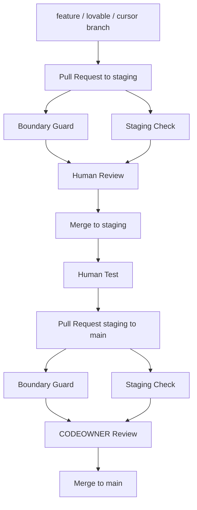

# Phase 4 Checklist

Phase Label: PHASE-4
Owner: محمدرضا افرا
Executor: مهدی حیدری
Source of Truth: GitHub

## Goal

Complete the GitHub guardrail layer for separating Lovable UI work from Cursor engineering work.

## Required repository files

- `.github/CODEOWNERS`
- `.github/pull_request_template.md`
- `.github/workflows/boundary-guard.yml`
- `.github/workflows/staging-check.yml`
- `docs/process/lovable-cursor-boundary.md`
- `docs/process/BRANCH_STRATEGY.md`
- `docs/process/GITHUB_GUARDRAILS.md`

## Required GitHub checks

Use these check names in branch settings after the workflows run at least once:

- `Boundary Guard`
- `Staging Check`

## Required branch settings

Apply these settings to both `staging` and `main`:

- Require pull request before merge.
- Require passing status checks.
- Require the `Boundary Guard` check.
- Require the `Staging Check` check.
- Require conversation resolution.
- Keep branch deletion disabled.
- Keep forced history rewrite disabled.

For `main`, also require review from CODEOWNERS.

## Recommended PR flow

## Final acceptance

Phase 4 is complete only when the repository files exist and GitHub settings enforce the checks on both `staging` and `main`.
